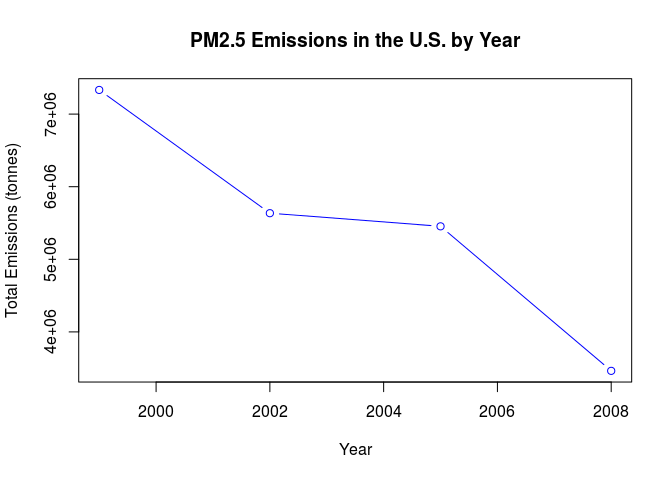
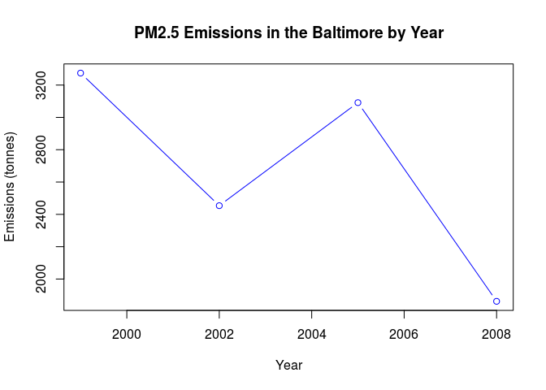
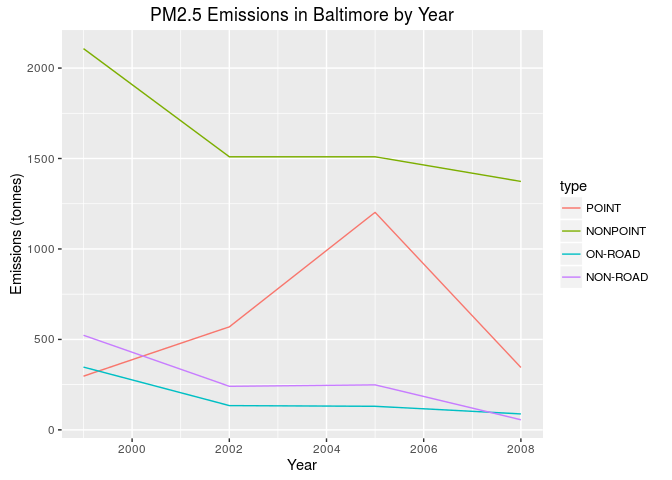
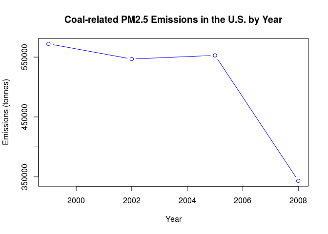
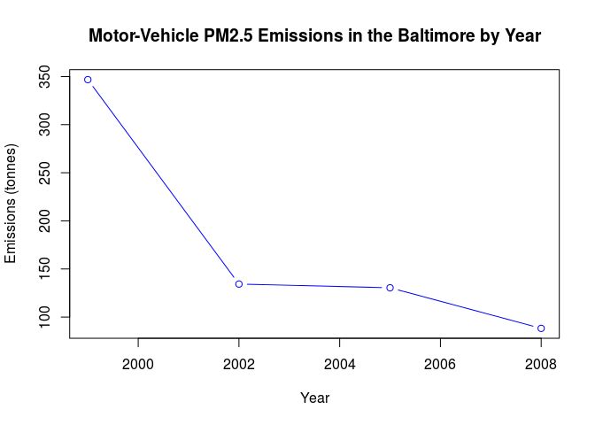
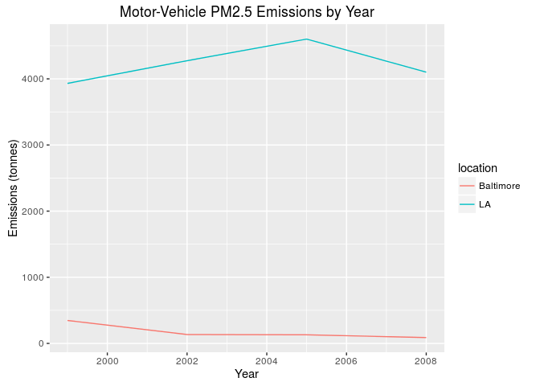
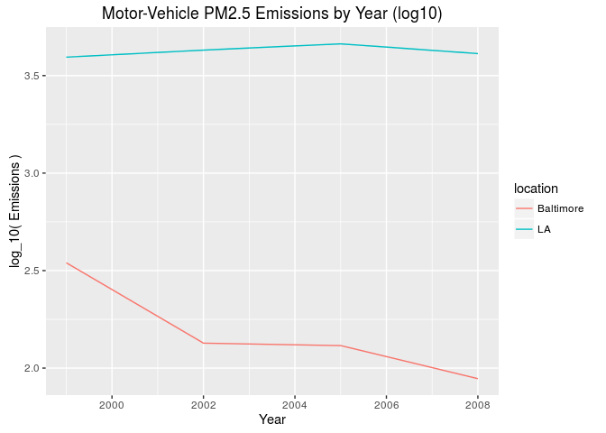

# Fine particulate matter pollution in U.S.
A. C. Dennerley  
January 28, 2016  

Fine particulate matter (PM2.5) is an ambient air pollutant for which there is strong evidence that it is harmful to human health. In the United States, the Environmental Protection Agency (EPA) is tasked with setting national ambient air quality standards for fine PM and for tracking the emissions of this pollutant into the atmosphere. Approximatly every 3 years, the EPA releases its database on emissions of PM2.5. This database is known as the National Emissions Inventory (NEI). More information about the NEI is available at the EPA National Emissions Inventory web site.  

The data here is of pollution from 1999-2008.  This document details my methods in both processing this data and answering a few simple questions as part of the Coursera 'Getting and Cleaning Data' (Jan 2016 offering) project.


```r
if(!require(data.table)) installed.packages("data.table")
```

```
## Loading required package: data.table
```

```r
if(!require(ggplot2)) installed.packages("ggplot2")
```

```
## Loading required package: ggplot2
```

```r
if(!require(lattice)) installed.packages("lattice")
```

```
## Loading required package: lattice
```

Start by forming a data frame.


```r
dat.main <- if(file.exists("summarySCC_PM25.rds")) {
        readRDS("summarySCC_PM25.rds") } else {
        readRDS(unzip("exdata_data_NEI_data.zip",files="summarySCC_PM25.rds")) }

head(dat.main)
```

```
##     fips      SCC Pollutant Emissions  type year
## 4  09001 10100401  PM25-PRI    15.714 POINT 1999
## 8  09001 10100404  PM25-PRI   234.178 POINT 1999
## 12 09001 10100501  PM25-PRI     0.128 POINT 1999
## 16 09001 10200401  PM25-PRI     2.036 POINT 1999
## 20 09001 10200504  PM25-PRI     0.388 POINT 1999
## 24 09001 10200602  PM25-PRI     1.490 POINT 1999
```

Next is a quick check for incomplete cases.


```r
sum(!complete.cases(dat.main[,1],dat.main[,2],dat.main[,3],dat.main[,4],dat.main[,5],dat.main[,6]))
```

```
## [1] 0
```

Before continuing, switching to the data.table format will make subsetting and plotting much faster.


```r
dat.main <- data.table(dat.main)
names(dat.main)
```

```
## [1] "fips"      "SCC"       "Pollutant" "Emissions" "type"      "year"
```

##Question 1
Have total emissions from PM2.5 decreased in the United States from 1999 to 2008? Using the base plotting system, make a plot showing the total PM2.5 emission from all sources for each of the years 1999, 2002, 2005, and 2008.

To accomplish this the built in tools of the data.table structure are amply sufficient to group entries by year and compute the sum of each group.  


```r
dat <- dat.main[,sum(Emissions),by=year]
setnames(dat,c("year","V1"),c("year","Total_Emissions"))
with(dat,plot(year,Total_Emissions,type="b",col="blue",
              xlab="Year",ylab="Total Emissions (tonnes)",main="PM2.5 Emissions in the U.S. by Year"))
```



A consistant decrease in total emissions is observable here.

##Question 2
Have total emissions from PM2.5 decreased in the Baltimore City, Maryland (fips == "24510") from 1999 to 2008? Use the base plotting system to make a plot answering this question.

This time, the table of sums by year is contructed from the subset of data corresponding to Baltimore.


```r
dat <- subset(dat.main,fips=="24510")[,sum(Emissions),by=year]
setnames(dat,c("year","V1"),c("year","Total_Emissions"))

with(dat,plot(year,Total_Emissions,type="b",col="blue",
              xlab="Year",ylab="Emissions (tonnes)",main="PM2.5 Emissions in the Baltimore by Year"))
```



There is certainly more variation here, but the pollution is still decreasing overall.  

##Question 3
Of the four types of sources indicated by the type (point, nonpoint, onroad, nonroad) variable, which of these four sources have seen decreases in emissions from 1999–2008 for Baltimore City? Which have seen increases in emissions from 1999–2008? Use the ggplot2 plotting system to make a plot answer this question.

Multiple subsets can get messy so generating a key from the year and type as a factor should be more readable.  


```r
dat.main[,key:= paste(year,type,sep="-")]
dat <- subset(dat.main,fips=="24510")[,sum(Emissions),by=key]
setnames(dat,c("key","V1"),c("key","Combined_Em"))
```

Moving from the key back to single variable factors is possible via look-up table.  


```r
keyTable <- data.table( expand.grid(unique(dat.main$year),unique(dat.main$type)) )
setnames(keyTable,c("Var1","Var2"),c("year","type"))
# Generating the key factor by which to match.
keyTable[,keyhole:= paste(year,type,sep="-") ]
setkey(keyTable,keyhole)
```

By setting a key in the lookup table, it's values can be referenced by row.  Now the descriptive columns of 'year' and 'type' are appended.


```r
dat[,year:= keyTable[key,year] ]
dat[,type:= keyTable[key,type] ]
```

An overlay of the individual contributions of each type of measurment for emissions provides a great comparison by 'type' of source.


```r
qplot(year,Combined_Em,data=dat,color=type,geom="line",
      main="PM2.5 Emissions in Baltimore by Year",
      xlab="Year",ylab="Emissions (tonnes)")
```



Clearly nonpoint sources have contributed the largest fraction of the pollution historically.  The significant decrease in nonpoint source pollution appears to be the primary cause in the overall decrease.  Onroad and nonroad sources decreased somewhat consistently.  Point source emissions seem to be the only type to have a net increase over the years, as well as an increasing trend in general.

##Question 4
Across the United States, how have emissions from coal combustion-related sources changed from 1999–2008?

The "SCC" variable holds a code to reference more detailed information on the sources in a second file.


```r
dat.ref <- if(file.exists("Source_Classification_Code.rds")) {
        data.table(readRDS("Source_Classification_Code.rds")) } else {
        data.table(
          readRDS(
            unzip("exdata_data_NEI_data.zip",files="Source_Classification_Code.rds")
        ))}

head(dat.ref)
```

```
##         SCC Data.Category
## 1: 10100101         Point
## 2: 10100102         Point
## 3: 10100201         Point
## 4: 10100202         Point
## 5: 10100203         Point
## 6: 10100204         Point
##                                                                    Short.Name
## 1:                   Ext Comb /Electric Gen /Anthracite Coal /Pulverized Coal
## 2: Ext Comb /Electric Gen /Anthracite Coal /Traveling Grate (Overfeed) Stoker
## 3:       Ext Comb /Electric Gen /Bituminous Coal /Pulverized Coal: Wet Bottom
## 4:       Ext Comb /Electric Gen /Bituminous Coal /Pulverized Coal: Dry Bottom
## 5:                   Ext Comb /Electric Gen /Bituminous Coal /Cyclone Furnace
## 6:                   Ext Comb /Electric Gen /Bituminous Coal /Spreader Stoker
##                                 EI.Sector Option.Group Option.Set
## 1: Fuel Comb - Electric Generation - Coal                        
## 2: Fuel Comb - Electric Generation - Coal                        
## 3: Fuel Comb - Electric Generation - Coal                        
## 4: Fuel Comb - Electric Generation - Coal                        
## 5: Fuel Comb - Electric Generation - Coal                        
## 6: Fuel Comb - Electric Generation - Coal                        
##                  SCC.Level.One       SCC.Level.Two
## 1: External Combustion Boilers Electric Generation
## 2: External Combustion Boilers Electric Generation
## 3: External Combustion Boilers Electric Generation
## 4: External Combustion Boilers Electric Generation
## 5: External Combustion Boilers Electric Generation
## 6: External Combustion Boilers Electric Generation
##                  SCC.Level.Three
## 1:               Anthracite Coal
## 2:               Anthracite Coal
## 3: Bituminous/Subbituminous Coal
## 4: Bituminous/Subbituminous Coal
## 5: Bituminous/Subbituminous Coal
## 6: Bituminous/Subbituminous Coal
##                                   SCC.Level.Four Map.To
## 1:                               Pulverized Coal     NA
## 2:             Traveling Grate (Overfeed) Stoker     NA
## 3: Pulverized Coal: Wet Bottom (Bituminous Coal)     NA
## 4: Pulverized Coal: Dry Bottom (Bituminous Coal)     NA
## 5:             Cyclone Furnace (Bituminous Coal)     NA
## 6:             Spreader Stoker (Bituminous Coal)     NA
##    Last.Inventory.Year Created_Date Revised_Date Usage.Notes
## 1:                  NA                                      
## 2:                  NA                                      
## 3:                  NA                                      
## 4:                  NA                                      
## 5:                  NA                                      
## 6:                  NA
```
The "EI.Sector" column will indicate whether a given "SCC" code indicates a coal combustion.  Using RegEx to track mention of coal in "EI.Sector" can be used to subset all cases of interest.

```r
# at least one white space or beginning of line
# 'coal' with no case dependance
# at least one white space or end of line
isCoal <- grepl( "( +|^)[Cc][Oo][Aa][Ll]( +|$)", dat.ref$EI.Sector )

# List of coal combustion source codes
coalSCC <- dat.ref$SCC[ isCoal ]

dat <- dat.main[ SCC %in% coalSCC ][,sum(Emissions),by=year]
setnames(dat,c("year","V1"),c("year","Total_Emissions"))
```
Now plotted by year.

```r
with( dat,
      plot(year,Total_Emissions,type="b",col="blue",
           xlab="Year",ylab="Emissions (tonnes)",
           main="Coal-related PM2.5 Emissions in the U.S. by Year")
)
```



Emission by coal combustion-related sources had decreased considerably from 5.721265\times 10^{5} to 3.4343222\times 10^{5} tonnes; a 39.97% drop.  91.58% of the change occured during 2005-2008.

##Question 5

How have emissions from motor vehicle sources changed from 1999–2008 in Baltimore City?


```r
# Mobile or mobile
# a gap of any number of characters in any combination
# Vehicle, Vehicles, vehicle, or vehicles
isMotorVehicle <- grepl( "[Mm]obile .+ [Vv]ehicle([s]?)", dat.ref$EI.Sector )

# List of relevant SCC numbers.
mvSCC <- dat.ref$SCC[ isMotorVehicle ]

# Sum total motor-vehicle emissions in baltimore by year.
dat.mvBalt <- dat.main[fips=="24510" & SCC %in% mvSCC ][,sum(Emissions),by=year]
setnames(dat.mvBalt,c("year","V1"),c("year","Total_Emissions"))
```


```r
with( dat.mvBalt,
      plot( year,Total_Emissions,type="b",col="blue",
            xlab="Year",ylab="Emissions (tonnes)",
            main="Motor-Vehicle PM2.5 Emissions in the Baltimore by Year")
)
```



Motor-vehicle emissions in Baltimore have dropped 39.97% between 1999 and 2008.

##Question 5

Compare emissions from motor vehicle sources in Baltimore City with emissions from motor vehicle sources in Los Angeles County, California (fips == "06037"). Which city has seen greater changes over time in motor vehicle emissions?


```r
# Table for L.A. motor vehicle emissions.
dat.mvLA <- dat.main[fips=="06037" & SCC %in% mvSCC ][,sum(Emissions),by=year]
setnames(dat.mvLA,c("year","V1"),c("year","Total_Emissions"))

dat.mvBalt[,location := "Baltimore"]
dat.mvLA[,location := "LA"]

dat <- rbind(dat.mvBalt,dat.mvLA)
dat[, logEmissions := log10(Total_Emissions)]
```


```r
par(mfrow=c(1, 2), mar=c(4, 4, 1, 1))

qplot(year,Total_Emissions,data=dat,color=location,geom="line",
      main="Motor-Vehicle PM2.5 Emissions by Year",
      xlab="Year",ylab="Emissions (tonnes)")
```



```r
qplot(year,logEmissions,data=dat,color=location,geom="line",
      main="Motor-Vehicle PM2.5 Emissions by Year (log10)",
      xlab="Year",ylab="log_10( Emissions )")
```



So the L.A. has a massive volume of emission at 1999 which increases consistently until 2005, where it begins to decrease.  Overall, the emission in L.A. increased by 170.201 tonnes (4.33%).  A base 10 log plot better shows the changes with respect to overall magnitude of the emission (ie decrease of 0.69 means emission is halved, increase of 0.69 means emission is doubled).  So while LA changes are much larger than Baltimore, Baltimore experiences a larger change percent-wise, finishing at 25.45% of it's initial emissions relative to LA's finishing 104.33%


